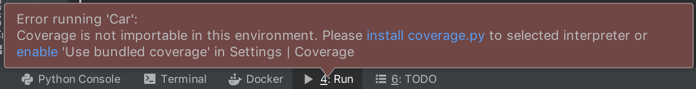
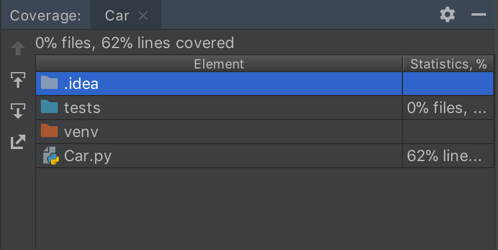
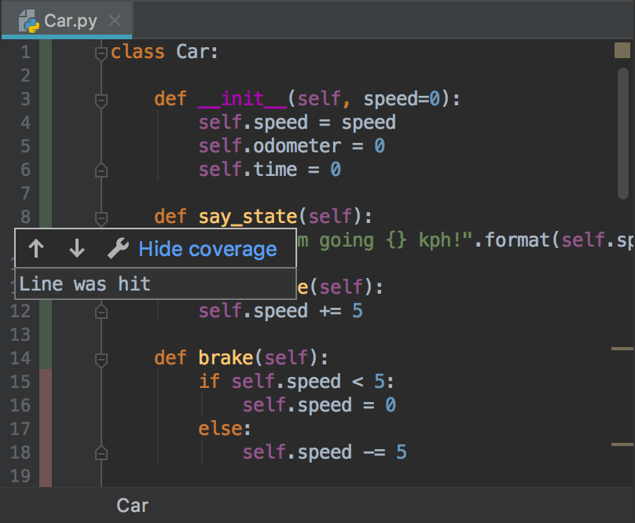
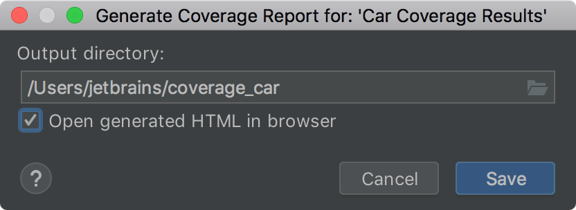

In this step, you obtain and evaluate coverage data for your project.

**Powerful Shortcuts**: 
-  `Alt-Ctrl-F6` (Win/Linux) or `Alt-Command-F6` (macOS) to show coverage data.

When working on a big project, you often need to collect code coverage statistics.
PyCharm comes with some handy instruments to collect, visualize, and summarize code coverage details.

# Enable code coverage in your project

# Preview coverage data

Show coverage in the gutter

 - Helpful when you need to recall, which parts of your code need new tests
 - You can alter the colors in the Settings/Preferences dialog
 
 # Generate report
 
 Sometimes you need to meet customer's requirement for the certain percent of code coverage:
 easy to generate the report and hand-off to the customer or publish on the target server.
 
  

