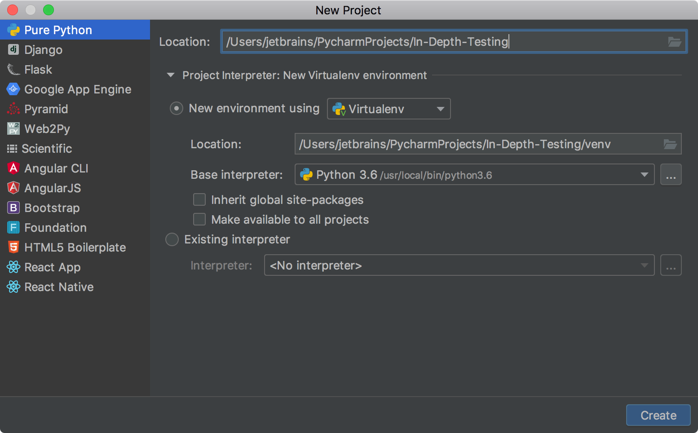
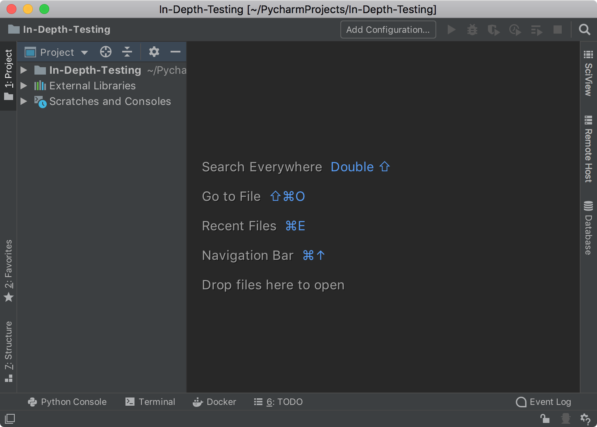

In this step, you can setup your project and select the dedicated test runner.
Whatever you do in PyCharm, you do it in a project. So, first of all let's create the
dedicated project, then add your application, and select how it will be tested.

# Create a Project

1. Run your PyCharm installation. Depending on your previous work, you have two
options:
    - If you’re on the **Welcome** screen, click the **Create New Project** link. 
    - If you’ve already got a project open, choose **File | New Project** from the main menu.
2. You need to specify a project interpreter to run your application and tests, so 
in the **New Project** dialog you need to enter the project name, and either accept the
default virtual environment settings or setup a new one. 

    
    Click **Create** to finalize this step.
3. When you have just created a project in PyCharm, you should expect to see the project tree:
    
    
          