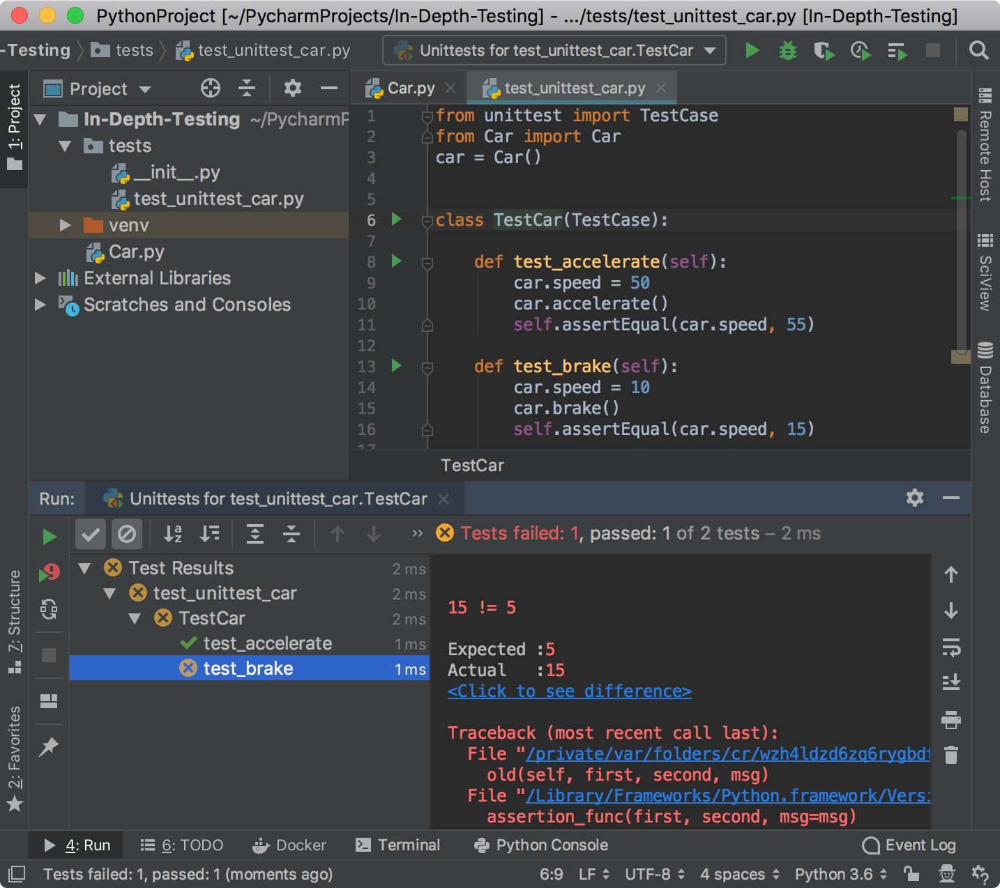

In this step, you learn how to run tests and evaluate the execution results.

**Powerful Shortcuts**: 
-  `Shift-10` (Win/Linux) or `Ctrl-R` (macOS) to execute a test.

**How you can run the test**
- Shortcuts
- The **Run** icon in the left gutter of the **Editor**
- Context menu in the test code
- Context menu in the test tree of the **Test runner** tab 

# Run the test

The easiest way to execute the test is to press `Shift-10` (Win/Linux) or `Ctrl-R` (macOS).
The **Run** tool window opens and shows the test execution status:
 

Although the very first test is quite simple, you can obtain the detailed information about the 
test execution in the **Test Runner** tab.

Examine the **Test Runner** tab of the **Run** window.
It has two toolbars to perform various actions with tests:
 - The <a href="https://www.jetbrains.com/help/pycharm/test-runner-tab.html#runToolbar" target="_blank">Run toolbar</a> 
 the left (vertical) toolbar that enables
 - The <a href="https://www.jetbrains.com/help/pycharm/test-runner-tab.html#testingToolbar" target="_blank">Testing toolbar</a>
  the top (horizontal) toolbar that  

To run each test function separately, you can opt to an alternative way for executing tests and
scripts in PyCharm - clicking the corresponding **Run** icon in the left gutter of the **Editor**

 

# Rerun tests automatically
TODO