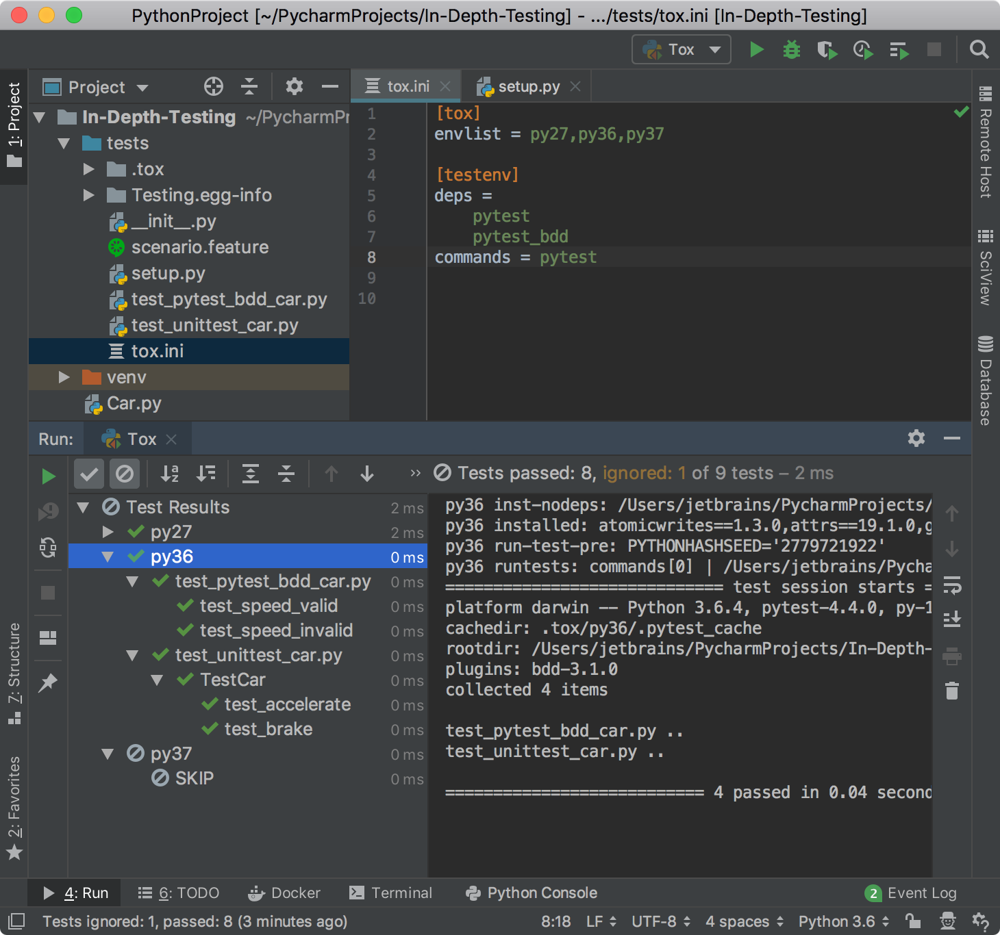

In this step, you run all your test suites on several interpreters.

**Powerful Shortcuts**: 
-  `Ctrl-Shift-F10` (Win/Linux) or `Ctrl-R` (macOS) to run the `tox.ini` file.

# Enable using tox in your project

TODO

```ini
[tox]
envlist = py27,py36,py37

[testenv]
deps =
    pytest
    pytest_bdd
commands = pytest
```

# Create the setup.py file

TODO **Tools | Create setup.py**

```python
from setuptools import setup


setup(
    name='Testing',
    version='',
    packages=[''],
    url='',
    license='',
    author='jetbrains', install_requires=['pytest']
)


```

# Run all tests with tox


 
